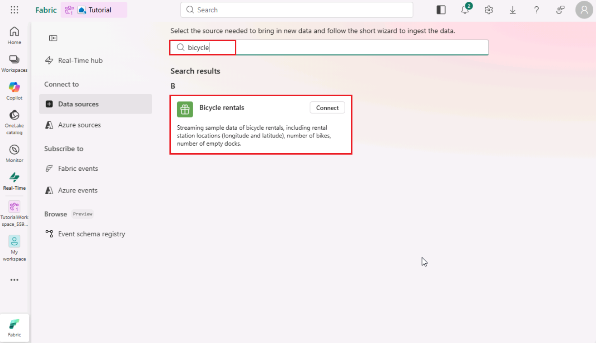
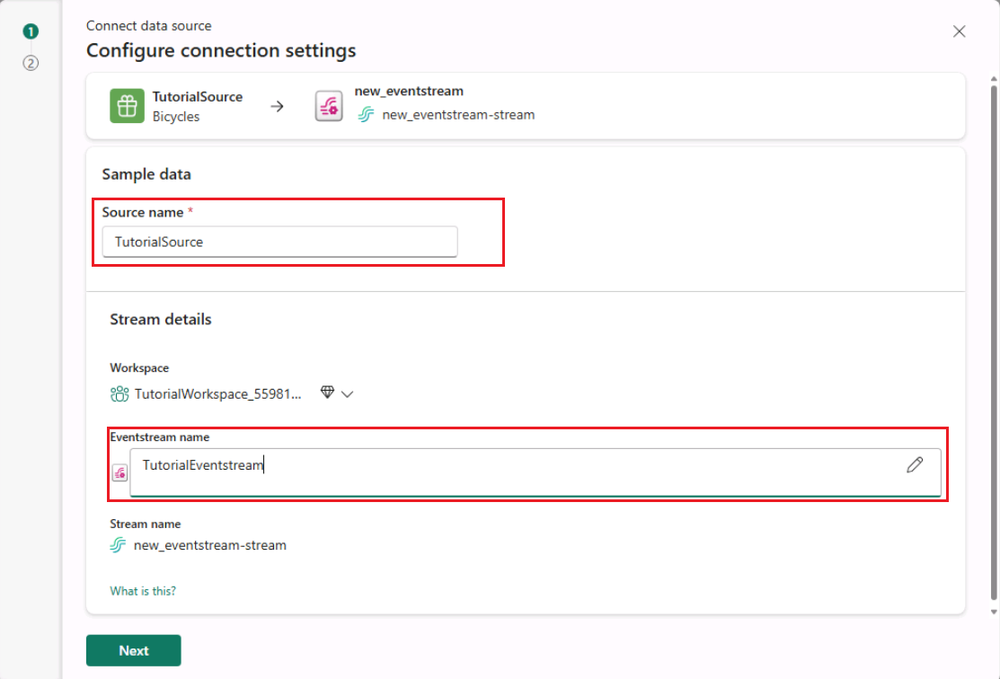
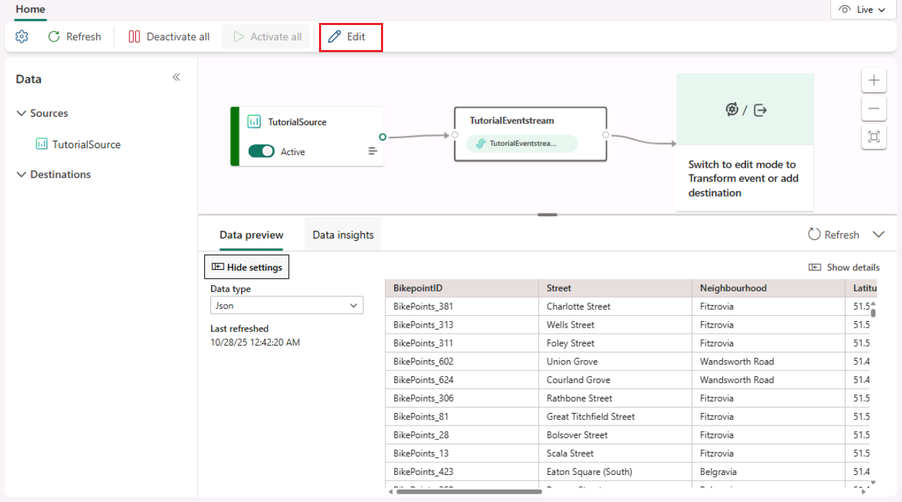
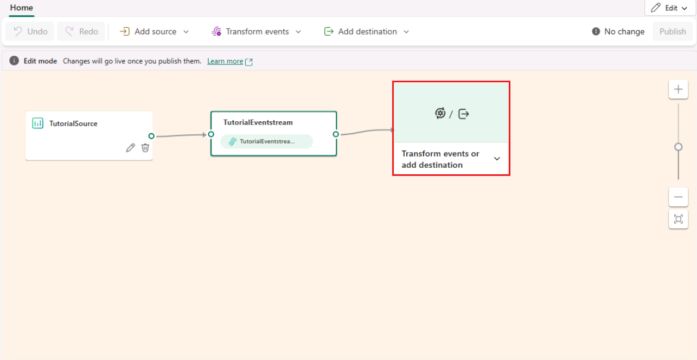
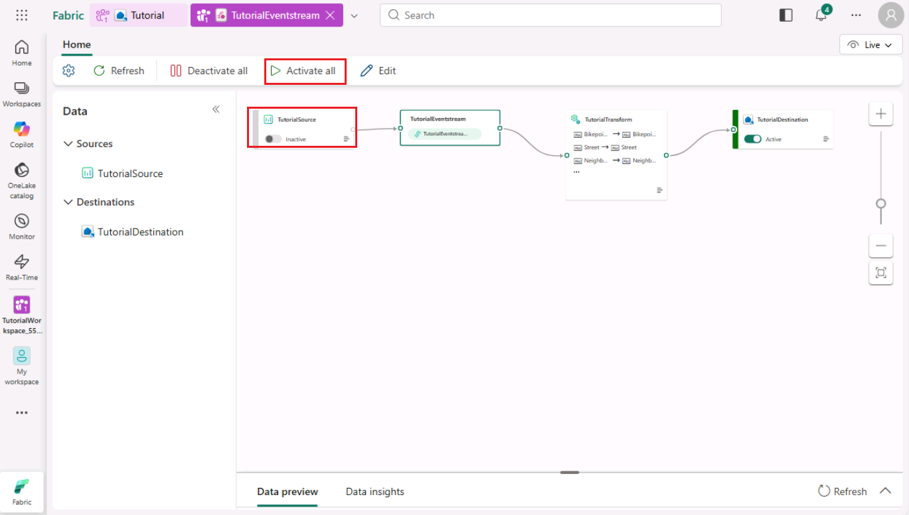

# Real-Time Intelligence tutorial part 2: Get data in the Real-Time hub

In this part of the tutorial, you browse the Real-Time hub, create an eventstream, transform events, and create a destination to send the transformed events to a KQL database. You then subscribe to Fabric Events, so that you will receive an alert each time a new item is created in your workspace.

## Create an eventstream

1. From the left navigation bar, select **Real-Time**. You may get a dialog Welcome to Real-Time hub. Click **Get started** to close the dialog.

2. Select **+ Connect data source**.

   

3. The **Connect a data source** pane opens. Select **Sample scenarios** category, and the select **Connect** on the _Bicycles rentals_ tile.

   

4. On the **Connect page**, for **Source name**, enter +++_TutorialSource_+++.
5. In the **Stream details** section, under _Workspace_ select your workspace named **_TutorialWorkspace_** and then select the pencil icon, and change the name of the eventstream to +++_TutorialEventstream_+++, notice that it will automatically assign the **Stream name** to be _TutorialEventstream-stream_. Select **Next**.

   

6. On the **Review + connect** page, review settings and select **Connect**.

   A new eventstream named _TutorialEventstream_ is created.

## Transform events - add a timestamp

1. On the **Review + connect** page, select **Open Eventstream**.

   You can also browse to the eventstream from the **My data streams** by selecting the stream and then selecting **Open Eventstream**.

2. From the menu ribbon, select **Edit**. The authoring canvas, which is the center section, turns yellow and becomes active for changes.

   

3. In the event stream authoring canvas select the down arrow on the **Transform events or add destination** tile, and then select **Manage fields**.

   

4. Select **Manage fields**. The tile is renamed to _Manage_fields_.
5. Select the pencil icon on the _Manage_fields_ tile.
6. In the Manage fields pane, do the following actions:

   i. In **Operation name**, enter +++_TutorialTransform_+++.

   ii. Select **Add all fields**.

   iii. Select **+ Add field**.

   iv. From the **Field** dropdown, expand **Built-in Date Time Function** then select **SYSTEM.Timestamp()**.

   

   v. Enter +++_Timestamp_+++ as the **Name**.

   vi. Select **Add**.

7. Confirm that **Timestamp** is added to the field list, and select **Save**. The _TutorialTransform_ tile now displays but with an error, because the destination isn't configured yet.

## Create a destination for the timestamp transformation

1. Hover over the right edge of the _TutorialTransform_ tile and select the green plus icon.
2. Select **Destinations** > **Eventhouse**.

   A new tile is created entitled _Eventhouse_. A new tile is created entitled _Eventhouse_.

3. Select the pencil icon on the _Eventhouse_ tile.

      

4. Enter the following information in the **Eventhouse** pane:

   

   | Field                 | Value                                                        |
   | --------------------- | ------------------------------------------------------------ |
   | **Data ingestion mode** | _Event processing before ingestion_                          |
   | **Destination name**  | +++_TutorialDestination_+++                                  |
   | **Workspace**         | Select the workspace in which you've created your resources. |
   | **Eventhouse**        | _Tutorial_                                                   |
   | **KQL Database**      | _Tutorial_                                                   |
   | **Destination table** | _Create new_ - enter +++_RawData_+++ as table name     |
   | **Input data format** | _JSON_                                                       |

5. Ensure that the box **Activate ingestion after adding the data** is checked.
6. Select **Save**.
7. From the menu ribbon select **Publish**.

> [!NOTE]
> In case you see the Source has been deactivated, as in the screenshot below, select **Activate all** to manually activate the source.

   

The event stream is now set up to transform events and send them to a KQL database. The insights are not yet available to create alerts, you will do this in a later step so you can monitor the number of bikes in real-time. For now, you can move on to the next step to query the data in the KQL database.

## Subscribe to Fabric Events

To subscribe to any changes in your workspace, you can use Fabric events. In this section, you set alerts on Fabric Events so that you receive an email each time a new item is created, deleted, or updated in your workspace. In different scenarios, the Activator could also be used to trigger a Fabric item, such as a pipeline or a notebook.

1. Browse to the Real-Time hub on the left navigation bar.
2. In the left pane, select **Subscribe to** > **Fabric Events**.
3. Hover over **Workspace item events** and select the alert icon.

    

### Configure the events for the alert

1. In the **Set alert** pane that opens, under **Monitor** > **Source**, select **Select events**.
    The default selection is six types of events that include success and failure of item creation, deletion, and update.

2. Under **Workspace**, select the workspace in which you created your resources.
3. Select **Next**.

    

4. Select **Save**.

### Configure the alert

1. Under **Save location** > **Workspace**, select the workspace in which you created your resources.
2. Select **Item** > **Create a new item**.
3. **Enter a name** for the item, such as **WorkspaceItemChange**.
4. Select **Create**.
    It may take a few moments for the item to be created.
5. Once the item is created, select **Open**.

A new tab opens in your browser with the Activator item you have just created. You can use this view to see the history of alerts, and to configure the alert further. 

> [!NOTE]
> If you are using a demo tenant and do not have access to the connected email, you may want to add a different email recipient to the alert. Do this by adding a new email address in the **To** field, and then selecting **Save and update**.

### Customize the message

In this section, you can (optionally) customize the email message that is received to include information about the condition which set off the alert.

1. In the **Definition** pane, under **Action** select **Edit action**.
2. In the **Edit the action** window, click on the field next to **Context**.
3. Select the checkboxes next to the following fields:

    * itemName
    * itemKind
    * __type

4. Select **Apply**.

    

5. Select **Save and update**.

## Next step

> Select **Next >** to transform streaming data in a KQL database.
