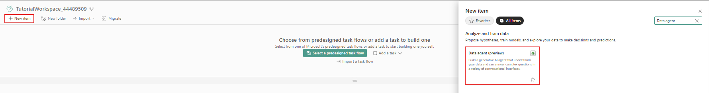
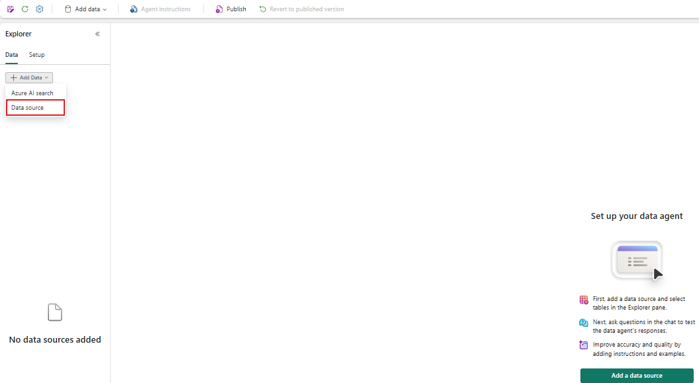
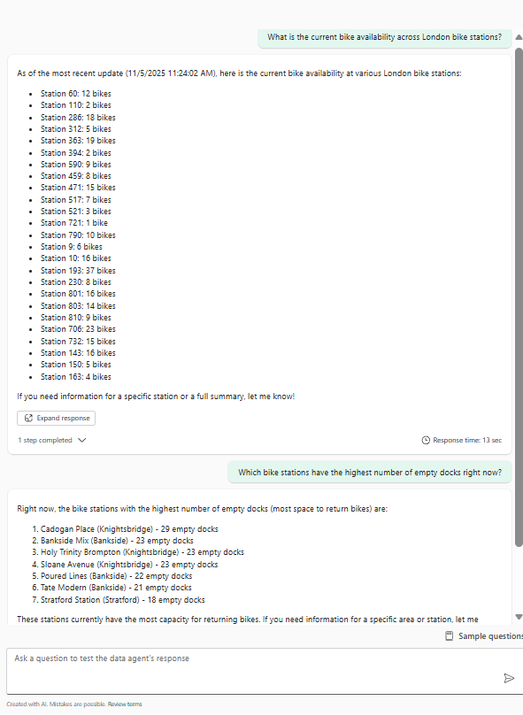

# Real-Time Intelligence tutorial part 8: Use Data agent on your data

In this part of the tutorial, you learn how to create a Fabric data agent and use it to have a natural language conversation with your eventhouse data.

## Create a Data agent

1. Browse to the workspace and in upper left corner select the **+ New item** button. Then search for and select **Data agent**.



2. Enter **TutorialDataAgent** as Name
3. In the Explorer pane on the left, select **+ Add Data**, select **Data source**.



4. OneLake catalog opens. Select **Tutorial** eventhouse you created in the previous exercises. Then select **Add**.


5. Under Tuorial eventhouse, select **TransformedData** table.
6. Select **Agent instructions** tab, and enter the following instructions:

    ```
    - You are an expert data analyst. Use the data in the eventhouse to answer questions about bike availability in London bike stations. Provide insights and trends based on the data.
    - Number of bikes is in the No_Bikes column and number of empty docks is in the No_Empty_Docks column.
    - Always provide latest information based on Timestamp column.
    ```
7. Close the Agent instruction tab
8. TutorialDataAgent is now ready to use.
9. Ask the following question to the data agent:

    - "What is the current bike availability across London bike stations?"
    - "Which bike stations have the highest number of empty docks right now?"



10. Feel free to experiment by providing more instructions to the agent or by asking other questions.

> Select **Next >** to clean up resources
